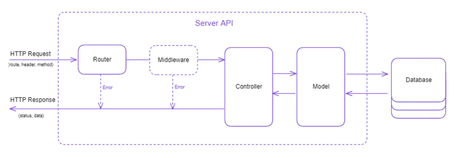

---
# cspell:disable
marp: true
author: Benoit du Mesnildot
title: Présentation titre DWWM
# transition: flip
header: ""
footer: "**CRUZZLE** Wild Code School - sept 2023"
paginate: true
theme: uncover
style: |
  section {
    background-color: #f9f4fb;
    color: #000;
  }
  h1, h2, h3, h4, h5, h6 {
    color: #922db0;
  }
  a {
    color: #000;
  }
---

<!-- _paginate: false -->

---
#### Sommaire

1. Présentation générale
2. Spécifications fonctionnelles
3. Design graphique
4. Démo
5. Spécifications techniques
6. Fonctions CRUD
7. Sécurisation et contrôles d'accès
8. Axes d'amélioration

---

#### Présentation générale

Contexte : créer une plateforme d'idéation

Equipe : 5 personnes

Calendrier : 10 semaines

Méthodologie : Agile SCRUM

---

#### Spécifications fonctionnelles
| Sécurité | Idées | Utilisateurs | Divers |
| :---: | :---: | :---: | :---: |
| Login | Equipes | Profils | Dashboard |
| Admin | Commentaires | Activités | Notifications |
|  | Likes | Gamification | Langues |

---

<!-- _footer: "" -->

###### Parcours Utilisateur

---

#### Design graphique
UI : Créativité, Convivialité, Professionnalisme

UX : Accessibilité, Simplicité, Intuitivité

Maquettage : Figma, mobile first, responsive

---

#### Démo [:link:](http://localhost:3000/)

---

#### Spécifications techniques
###### FRONTEND | BDD & BACKEND

---

##### Frontend : stack technique

- React
- Material-UI
- Tailwind CSS
- React Router Dom
- Axios
- Dayjs
- PropTypes
- ESLint / Prettier

---

<!-- _footer: "" -->

###### Frontend : architecture de l'application

---

<!-- _footer: "" -->

###### Base de données : diagramme relationnel

---

##### Backend : stack technique

- TypeScript - Node.js
- Express
- CORS - Helmet
- MySQL2
- Prisma
- Axios
- Multer
- Bcrypt / JSON Web Token
- ESLint (Airbnb) / Prettier

---
<!-- _footer: "" -->

###### Backend : architecture MVC

---

#### Fonctions CRUD
###### CREATE | READ | UPDATE | DELETE
###### _- présentation d'extraits de code pour CREATE & READ-_

---

###### CREATE (POST)
code côté __client__ pour la création d'un utilisateur

---

###### CREATE (POST)
code __controller__ côté __server__ pour la création d'un utilisateur

---

###### CREATE (POST)
code __model__ côté __server__ pour la création d'un utilisateur

---

###### READ (GET)
code côté __client__ pour la récupération de la liste des utilisateurs

(choix de la vérité vs optimistic ui)

---

###### READ (GET)
code __model__ côté __server__ pour la création d'un utilisateur

---

###### READ (GET)
requête __SQL__ équivalente pour la récupération de la liste des utilisateurs

---

#### Sécurisation et controlles d'accès
###### Authentification Vs Authorization

---
<!-- _footer: "" -->

###### Echanges client / serveur

---

#### Axes d'amélioration
- Refactorisation et Typage du code
- Optimisation des requêtes
- Intégration de tests unitaires et fonctionnels
- Gestion des jetons d’authentification

---

#### Merci pour votre attention !
